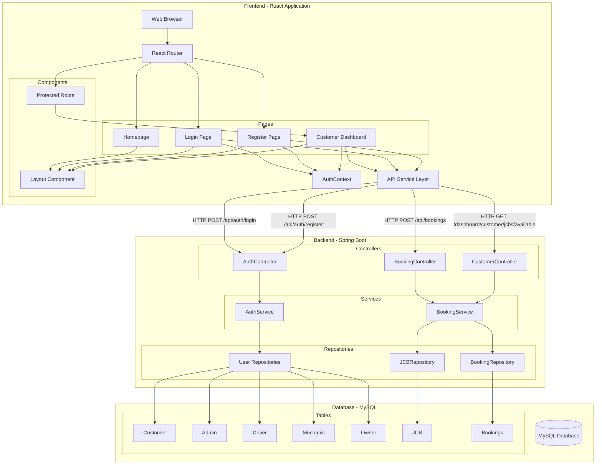
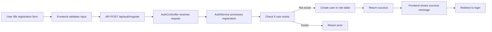
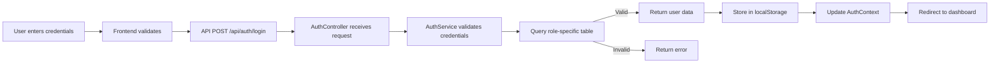
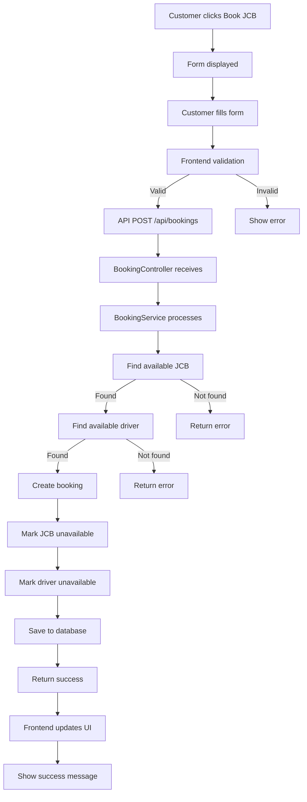
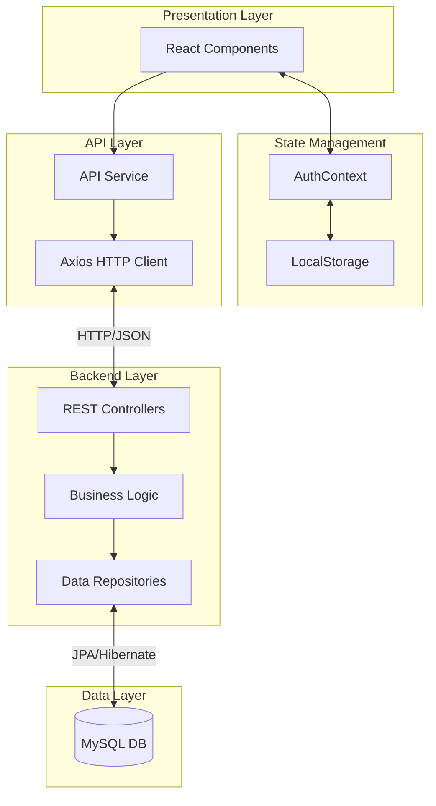
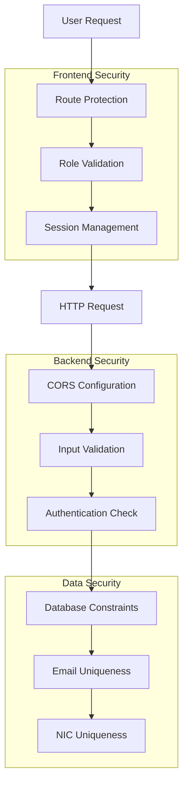
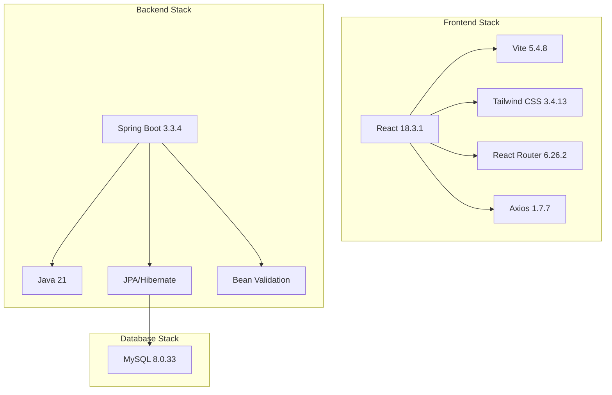
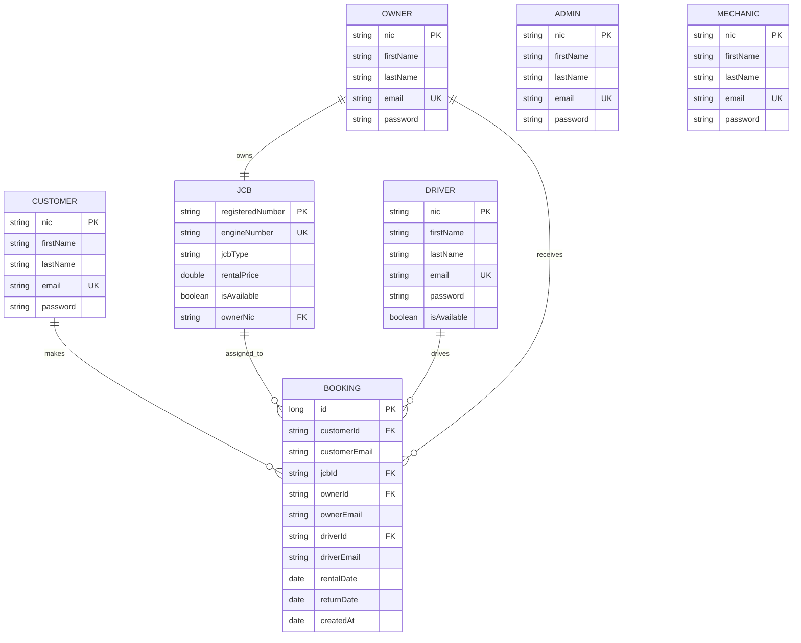
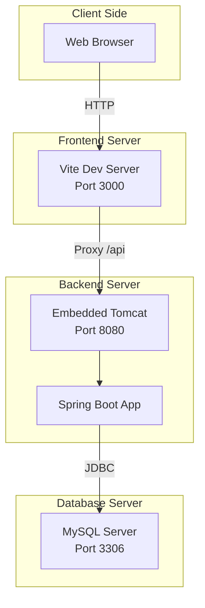
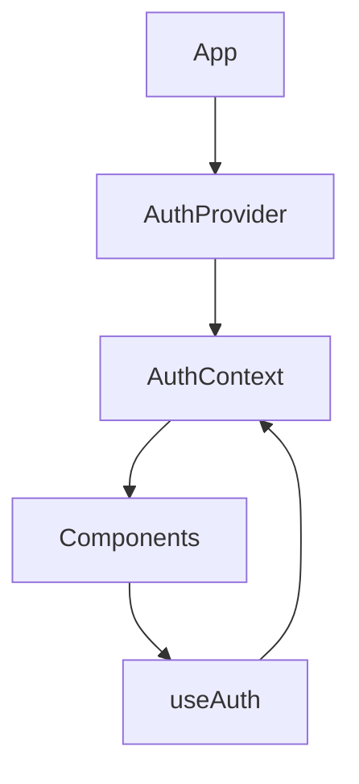

# JCB Management System - Architecture Overview

## System Architecture Diagram



## Component Interaction Flow

### User Registration Flow



### User Login Flow



### JCB Booking Flow



## Data Flow Architecture



## Security Architecture



## Technology Stack Layers



## Database Schema



## API Endpoint Structure

### Authentication Endpoints
```
POST /api/auth/register
    Request: { nic, email, username, firstName, lastName, password, role }
    Response: { success, message, user }

POST /api/auth/login
    Request: { email, password, role }
    Response: { success, message, user }
```

### Booking Endpoints
```
POST /api/bookings
    Request: { customerNic, jcbType, rentalDate, returnDate, acceptPrice, acceptTerms }
    Response: Success/Error message

GET /api/bookings/customer/{customerNic}
    Response: [ { id, jcbId, rentalDate, returnDate, ... } ]

DELETE /api/bookings/{id}
    Response: Success/Error message
```

### Customer Endpoints
```
GET /dashboard/customer/jcbs/available
    Response: [ { registeredNumber, jcbType, rentalPrice, ... } ]

POST /dashboard/customer/book
    Request: { customerNic, jcbType, rentalDate, returnDate, acceptPrice, acceptTerms }
    Response: Success/Error message
```

## Deployment Architecture



## Design Patterns Used

### 1. Strategy Pattern (Payment Processing)
```mermaid
graph TB
    BookingService --> PaymentStrategy
    PaymentStrategy <|.. CashPayment
    PaymentStrategy <|.. CreditCardPayment
    PaymentStrategy <|.. PayPalPayment
```

### 2. Repository Pattern (Data Access)
```mermaid
graph TB
    Service --> Repository
    Repository <|.. CustomerRepository
    Repository <|.. BookingRepository
    Repository <|.. JCBRepository
    Repository --> JPA
    JPA --> Database
```

### 3. Context Pattern (State Management)


## Security Considerations

### Current Implementation
- ✅ CORS configured for frontend-backend communication
- ✅ Input validation on both frontend and backend
- ✅ Protected routes based on user roles
- ✅ Session management with localStorage
- ✅ Email and NIC uniqueness constraints

### Recommended for Production
- 🔄 Password hashing (BCrypt)
- 🔄 JWT token-based authentication
- 🔄 HTTPS/SSL encryption
- 🔄 Rate limiting
- 🔄 SQL injection prevention (already using JPA)
- 🔄 XSS protection
- 🔄 CSRF protection

## Performance Considerations

### Frontend
- React component optimization
- Code splitting with React Router
- Lazy loading for routes
- Tailwind CSS purging in production
- Vite build optimization

### Backend
- JPA lazy loading for relationships
- Database connection pooling
- Transaction management
- Query optimization

### Database
- Indexed primary keys (NIC, registeredNumber)
- Unique constraints on email
- Foreign key relationships
- Proper data types

---

This architecture provides a solid foundation for the JCB Management System with clear separation of concerns, scalability, and maintainability.
