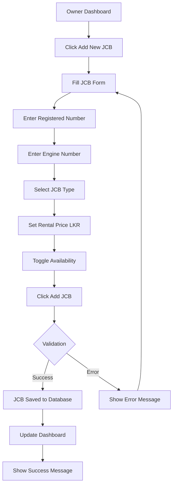
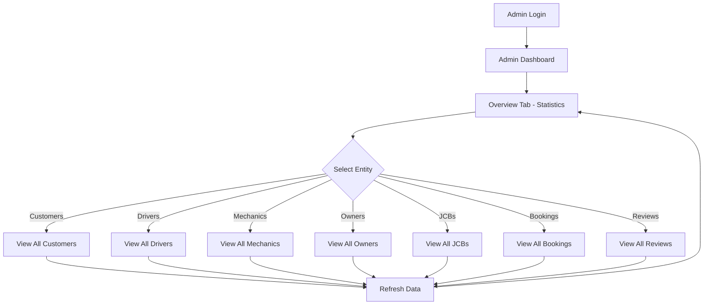

# JCB and Admin Management System - Complete Guide

## Overview
This guide covers two major features:
1. **Owner JCB Management**: Owners can register and manage their JCB equipment
2. **Admin System Management**: Admins can view all system data including users, JCBs, bookings, and reviews

---

## 🚜 Part 1: Owner JCB Management

### Features Implemented

#### 1. **Owner Dashboard**
- Beautiful gradient dashboard with subscription plan display
- Statistics cards showing:
  - Total JCBs owned
  - Available JCBs
  - Rented out JCBs
- Add new JCB functionality
- View and manage all registered JCBs
- Toggle JCB availability status
- Subscription-based features display (Normal/Premium plans)

#### 2. **Add JCB Modal**
- Interactive modal form for adding new JCB
- Fields:
  - Registered Number (unique identifier)
  - Engine Number (unique)
  - JCB Type (dropdown selection)
  - Daily Rental Price in LKR
  - Availability toggle
- Automatic owner association
- Real-time validation
- Success/error feedback

#### 3. **JCB Management**
- View all owned JCBs in card layout
- Each JCB card displays:
  - JCB Type and status badge
  - Registered number
  - Engine number
  - Daily rental rate in LKR
  - Availability toggle button
- Mark JCBs as available/rented
- Visual status indicators

---

## 👨‍💼 Part 2: Admin System Management

### Features Implemented

#### 1. **Comprehensive Admin Dashboard**
- **Tab-based Navigation** with 8 sections:
  - Overview
  - Customers
  - Drivers
  - Mechanics
  - Owners
  - JCBs
  - Bookings
  - Reviews

#### 2. **Overview Tab**
- System-wide statistics with 8 metric cards:
  - Total Customers
  - Total Drivers
  - Total Owners
  - Total Mechanics
  - Total JCBs
  - Total Bookings
  - Total Reviews
  - Average Rating
- One-click refresh for all data

#### 3. **Customers Tab**
- Complete list of all registered customers
- Table view with:
  - NIC
  - Full Name
  - Email

#### 4. **Drivers Tab**
- All registered drivers
- Availability status indicator
- Table columns:
  - NIC
  - Full Name
  - Email
  - Status (Available/Busy)

#### 5. **Mechanics Tab**
- All registered mechanics
- Basic information display:
  - NIC
  - Full Name
  - Email

#### 6. **Owners Tab**
- All registered owners with subscription details
- Table columns:
  - NIC
  - Full Name
  - Email
  - Subscription Plan (color-coded badges)
  - Monthly Fee in LKR

#### 7. **JCBs Tab**
- All registered JCBs in the system
- Grid card layout showing:
  - JCB Type
  - Registered Number
  - Engine Number
  - Owner NIC
  - Daily Rental Price
  - Availability Status

#### 8. **Bookings Tab**
- All system bookings
- Complete booking information:
  - Booking ID
  - Customer NIC
  - JCB ID
  - Driver Email
  - Rental Date
  - Return Date
  - Payment Method & Status

#### 9. **Reviews Tab**
- All customer reviews
- Comprehensive view showing:
  - Review ID
  - Customer ID
  - Booking ID
  - Submission date
  - Review type badge
  - Overall, Driver, and JCB ratings
  - All comments

---

## 📁 Files Created/Modified

### Frontend Files

#### New Files:
1. **`frontend/src/components/AddJCBModal.jsx`** - NEW
   - Modal component for adding JCBs
   - Form validation
   - JCB type dropdown (7 types)
   - Price input in LKR

2. **`frontend/src/pages/OwnerDashboard.jsx`** - NEW
   - Complete owner dashboard
   - JCB management interface
   - Subscription features display
   - Statistics cards

#### Modified Files:
3. **`frontend/src/pages/AdminDashboard.jsx`** - COMPLETELY REWRITTEN
   - Changed from review-only to comprehensive system management
   - 8-tab navigation system
   - All entity displays
   - Integrated statistics

4. **`frontend/src/services/api.js`** - UPDATED
   - Added `jcbAPI.addJCB()`
   - Added `jcbAPI.getOwnerJCBs()`
   - Added `jcbAPI.updateJCBAvailability()`
   - Added complete `adminAPI` with 5 methods

5. **`frontend/src/App.jsx`** - UPDATED
   - Imported OwnerDashboard component
   - Replaced placeholder with actual component

### Backend Files

#### New Files:
1. **`src/main/java/.../controller/AdminController.java`** - NEW
   - `/api/admin/customers` - GET all customers
   - `/api/admin/drivers` - GET all drivers
   - `/api/admin/mechanics` - GET all mechanics
   - `/api/admin/owners` - GET all owners
   - `/api/admin/jcbs` - GET all JCBs (duplicate of JCBController, for consistency)
   - `/api/admin/bookings` - GET all bookings

#### Modified Files:
2. **`src/main/java/.../controller/JCBController.java`** - UPDATED
   - Added CORS configuration
   - Added `GET /api/jcbs` - Get all JCBs
   - Added `GET /api/jcbs/owner/{ownerNic}` - Get owner's JCBs
   - Added `PUT /api/jcbs/{registeredNumber}/availability` - Update availability
   - Added `UpdateAvailabilityRequest` DTO

3. **`src/main/java/.../repository/JCBRepository.java`** - UPDATED
   - Added `findByOwner(Owner owner)` method

---

## 🔧 Backend API Endpoints

### JCB Management Endpoints

```
GET    /api/jcbs                              - Get all JCBs
GET    /api/jcbs/available                    - Get available JCBs
GET    /api/jcbs/owner/{ownerNic}             - Get JCBs owned by specific owner
POST   /api/jcbs                              - Add new JCB
PUT    /api/jcbs/{registeredNumber}/availability - Update JCB availability
```

### Admin Endpoints

```
GET    /api/admin/customers                   - Get all customers
GET    /api/admin/drivers                     - Get all drivers
GET    /api/admin/mechanics                   - Get all mechanics
GET    /api/admin/owners                      - Get all owners
GET    /api/admin/jcbs                        - Get all JCBs
GET    /api/admin/bookings                    - Get all bookings
```

---

## 📋 Usage Guide

### For Owners

#### Step 1: Register as Owner
1. Go to Registration page
2. Select role: **OWNER**
3. Choose subscription plan (Basic/Normal/Premium)
4. Complete registration

#### Step 2: Login
1. Login with your credentials
2. Select role: **OWNER**
3. You'll be redirected to Owner Dashboard

#### Step 3: Add Your First JCB
1. Click **"Add New JCB"** button
2. Fill in the form:
   - **Registered Number**: e.g., "JCB-001"
   - **Engine Number**: e.g., "ENG-12345"
   - **JCB Type**: Select from dropdown
   - **Daily Rental Price**: Enter amount in LKR
   - **Availability**: Check to make available immediately
3. Click **"Add JCB"**
4. JCB appears in your dashboard

#### Step 4: Manage JCBs
- **View All**: Scroll to "My Registered JCBs" section
- **Toggle Availability**: Click "Mark as Rented" or "Mark as Available"
- **View Statistics**: See total, available, and rented counts at top

### For Admins

#### Step 1: Login as Admin
1. Login with admin credentials
2. Select role: **ADMIN**
3. You'll be redirected to Admin Dashboard

#### Step 2: Navigate Tabs
Use the top navigation to switch between sections:
- **Overview**: System-wide statistics
- **Customers**: All customer accounts
- **Drivers**: All driver accounts with status
- **Mechanics**: All mechanic accounts
- **Owners**: All owners with subscription info
- **JCBs**: All registered equipment
- **Bookings**: All rental bookings
- **Reviews**: All customer feedback

#### Step 3: View Specific Data
- Click any tab to see detailed information
- Use tables for user data
- Use cards for JCBs and reviews
- Color-coded badges for statuses

#### Step 4: Refresh Data
- Click **"🔄 Refresh All Data"** in Overview tab
- Or switch between tabs to reload specific data

---

## 🎨 UI Features

### Owner Dashboard

#### Color Scheme:
- **Statistics Cards**: Green (total), Blue (available), Yellow (rented)
- **Subscription Badge**: Gray (Basic), Blue (Normal), Purple (Premium)
- **JCB Status**: Green (Available), Red (Rented)

#### Layout:
- Gradient header with owner info and subscription
- 3 statistics cards
- Add JCB button with prominent placement
- Grid layout for JCB cards (responsive: 1/2/3 columns)
- Subscription features section (Normal/Premium users)

### Admin Dashboard

#### Color Scheme:
- **Navigation Tabs**: Blue (active), White (inactive)
- **Statistic Cards**: Each entity has unique gradient color
- **Status Badges**: 
  - Green: Available, Completed, Active
  - Red: Unavailable, Failed, Busy
  - Yellow: Pending
  - Blue/Purple/Gray: Subscription tiers

#### Layout:
- Tab navigation at top
- Content area changes based on active tab
- Tables for user data (responsive, scrollable)
- Grid cards for JCBs
- List view for reviews and bookings

---

## 🔢 Available JCB Types

The system supports 7 JCB types:
1. **Excavator**
2. **Backhoe Loader**
3. **Skid Steer Loader**
4. **Bulldozer**
5. **Wheel Loader**
6. **Compactor**
7. **Trencher**

---

## 💾 Database Schema Updates

### JCB Table (Existing, Used):
```sql
CREATE TABLE jcb (
    registered_number VARCHAR(255) PRIMARY KEY,
    engine_number VARCHAR(255) UNIQUE,
    jcb_type VARCHAR(255) NOT NULL,
    rental_price DOUBLE NOT NULL,
    is_available BOOLEAN DEFAULT TRUE,
    owner_nic VARCHAR(255),
    FOREIGN KEY (owner_nic) REFERENCES owner(nic)
);
```

### Relationships:
- **Owner → JCB**: One-to-Many (one owner can have multiple JCBs)
- **JCB → Booking**: One-to-Many (one JCB can have multiple bookings)
- **JCB → Owner**: Many-to-One (many JCBs belong to one owner)

---

## 📊 API Request/Response Examples

### Add JCB (Owner)
```json
POST /api/jcbs
{
  "registeredNumber": "JCB-001",
  "engineNumber": "ENG-12345",
  "jcbType": "Excavator",
  "rentalPrice": 5000,
  "isAvailable": true,
  "ownerNic": "owner123"
}

Response: "Success: JCB added with registered number JCB-001"
```

### Get Owner's JCBs
```json
GET /api/jcbs/owner/owner123

Response: [
  {
    "registeredNumber": "JCB-001",
    "engineNumber": "ENG-12345",
    "jcbType": "Excavator",
    "rentalPrice": 5000,
    "isAvailable": true,
    "owner": {
      "nic": "owner123",
      "firstName": "John",
      "lastName": "Doe",
      "subscriptionPlan": "PREMIUM"
    }
  }
]
```

### Update JCB Availability
```json
PUT /api/jcbs/JCB-001/availability
{
  "isAvailable": false
}

Response: "Success: JCB availability updated"
```

### Get All Customers (Admin)
```json
GET /api/admin/customers

Response: [
  {
    "nic": "123456789V",
    "firstName": "Jane",
    "lastName": "Smith",
    "email": "jane@example.com"
  }
]
```

### Get All Bookings (Admin)
```json
GET /api/admin/bookings

Response: [
  {
    "id": 1,
    "customerId": "123456789V",
    "jcbId": "JCB-001",
    "driverId": "driver123",
    "driverEmail": "driver@example.com",
    "rentalDate": "2025-10-25T00:00:00",
    "returnDate": "2025-10-28T00:00:00",
    "paymentMethod": "CREDIT_CARD",
    "totalAmount": 15000,
    "paymentStatus": "COMPLETED"
  }
]
```

---

## ✅ Validation Rules

### JCB Registration:
- **Registered Number**: Required, must be unique
- **Engine Number**: Required, must be unique
- **JCB Type**: Required, must be from predefined list
- **Rental Price**: Required, must be positive number
- **Owner NIC**: Must exist in owner table
- **Availability**: Boolean, defaults to true

### Owner Requirements:
- Must be logged in as OWNER role
- Can only add JCBs to own account
- Can only manage own JCBs
- Can only view own JCBs

### Admin Requirements:
- Must be logged in as ADMIN role
- Read-only access to all data
- No modification capabilities (view only)

---

## 🎯 User Flows

### Owner Adding JCB Flow


### Admin Viewing System Data Flow


---

## 🚨 Troubleshooting

### Issue 1: Owner Cannot Add JCB
**Symptoms:**
- Error: "Owner with NIC xxx not found"

**Solutions:**
1. Verify owner is logged in
2. Check NIC matches registration
3. Ensure owner account exists in database:
```sql
SELECT * FROM owner WHERE nic = 'your_nic';
```

### Issue 2: Duplicate Registered Number
**Symptoms:**
- Error: "JCB with registered number xxx already exists"

**Solutions:**
1. Choose a different registered number
2. Check existing JCBs:
```sql
SELECT registered_number FROM jcb;
```

### Issue 3: Admin Cannot See Data
**Symptoms:**
- Empty tables or "No data" messages

**Solutions:**
1. Verify admin role:
```sql
SELECT * FROM admin WHERE email = 'admin@example.com';
```
2. Check CORS configuration in backend
3. Verify backend is running
4. Check browser console for errors

### Issue 4: JCB Not Appearing in Owner Dashboard
**Symptoms:**
- JCB added successfully but not visible

**Solutions:**
1. Refresh the page
2. Check owner NIC matches:
```sql
SELECT * FROM jcb WHERE owner_nic = 'your_nic';
```
3. Verify API endpoint `/api/jcbs/owner/{nic}` is working

---

## 📈 Future Enhancements

### For Owners:
1. **JCB Edit**: Modify JCB details after creation
2. **JCB Delete**: Remove JCBs from system
3. **Booking History**: See which JCBs were rented and when
4. **Revenue Analytics**: Track earnings per JCB
5. **Maintenance Scheduling**: Plan and track maintenance
6. **Photo Upload**: Add JCB images
7. **Document Management**: Upload insurance, registration docs

### For Admins:
1. **User Management**: Enable/disable accounts
2. **Booking Management**: Cancel or modify bookings
3. **Export Data**: Download reports as CSV/PDF
4. **Search & Filter**: Find specific records quickly
5. **Activity Logs**: Track all system actions
6. **Email Notifications**: Send alerts to users
7. **Dashboard Customization**: Drag-and-drop widgets
8. **Real-time Updates**: Live data refresh
9. **Charts & Graphs**: Visual analytics
10. **Audit Trail**: Track all admin actions

---

## 🔒 Security Considerations

### Implemented:
✅ Role-based access control (Owner/Admin)  
✅ Protected routes for dashboards  
✅ CORS configuration for API security  
✅ Owner can only manage own JCBs  
✅ Admin has read-only access  
✅ Validation on all inputs  
✅ Unique constraints on critical fields  

### Recommended:
- Add JWT authentication tokens
- Implement password hashing (currently plain text)
- Add rate limiting on API endpoints
- Implement CSRF protection
- Add data encryption for sensitive fields
- Implement audit logging for admin actions
- Add IP whitelisting for admin access

---

## 📝 Testing Checklist

### Owner JCB Management:
- [ ] Owner can register with subscription plan
- [ ] Owner can login and access dashboard
- [ ] Dashboard shows correct statistics
- [ ] Subscription plan displays correctly
- [ ] Add JCB button opens modal
- [ ] JCB form validates all fields
- [ ] JCB type dropdown works
- [ ] Price accepts only numbers
- [ ] Successfully add JCB
- [ ] JCB appears in list immediately
- [ ] Availability toggle works
- [ ] Status badges show correct color
- [ ] Subscription features display for Normal/Premium

### Admin Dashboard:
- [ ] Admin can login and access dashboard
- [ ] All 8 tabs are visible
- [ ] Overview shows correct statistics
- [ ] Can switch between tabs smoothly
- [ ] Customers table loads correctly
- [ ] Drivers table shows availability status
- [ ] Mechanics table displays all data
- [ ] Owners table shows subscription info
- [ ] JCBs grid displays all equipment
- [ ] Bookings table shows all reservations
- [ ] Reviews display with ratings
- [ ] Refresh button reloads data
- [ ] Tables are responsive on mobile
- [ ] Color-coded badges display correctly

### Integration Tests:
- [ ] Owner adds JCB, Admin sees it in JCBs tab
- [ ] Multiple owners with different JCBs
- [ ] JCB availability changes reflect in admin view
- [ ] Owner subscription plans display in admin Owners tab
- [ ] All entity counts match in Overview tab

---

## 📚 Summary

### What Was Implemented:

**Owner Features:**
1. Complete Owner Dashboard with JCB management
2. Add JCB functionality with 7 JCB types
3. View and manage all owned JCBs
4. Toggle JCB availability
5. Subscription plan integration with features display
6. Statistics and visual indicators

**Admin Features:**
1. Comprehensive dashboard with 8 tabs
2. View all customers, drivers, mechanics, owners
3. View all JCBs with details
4. View all bookings with payment info
5. View all reviews with ratings
6. System-wide statistics
7. Color-coded status indicators
8. Responsive tables and layouts

**Backend:**
1. 6 new admin API endpoints
2. 3 new/updated JCB endpoints
3. CORS configuration
4. Repository method additions
5. Complete AdminController

**Total Files:**
- **7 Frontend files** (2 new pages, 1 new component, 2 updated, 1 service update, 1 routing update)
- **3 Backend files** (1 new controller, 1 updated controller, 1 updated repository)
- **1 Documentation file** (this guide)

The system now has complete JCB management for owners and comprehensive system monitoring for admins! 🎉
