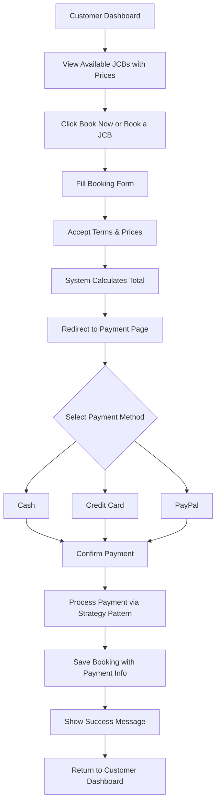
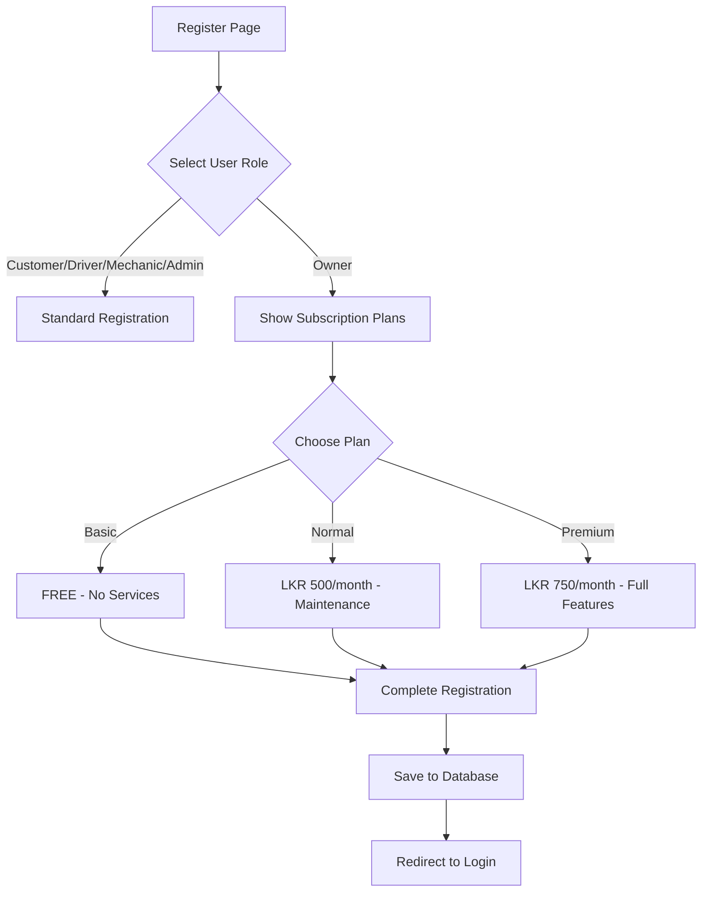

# Payment System Implementation Guide

## Overview
This document describes the comprehensive payment system implemented for both **Customers** (booking payments) and **Owners** (subscription plans).

---

## 🎯 Features Implemented

### For Customers: Booking Payment System

#### 1. **Payment Page**
- Dedicated payment page after booking form submission
- Three payment options:
  - 💵 **Cash Payment** - Pay on delivery
  - 💳 **Credit Card** - Secure card payment
  - 🅿️ **PayPal** - PayPal account payment

#### 2. **Enhanced JCB Display**
- Prices displayed prominently in **LKR** (Sri Lankan Rupees)
- Large, eye-catching price cards with gradient backgrounds
- "Book Now" button on each JCB card
- Daily rental rates clearly shown
- Animated "Available" badges

#### 3. **Booking Flow**
```
Customer Dashboard → Select JCB → Fill Booking Form → Payment Page → Confirmation
```

**Step-by-Step**:
1. Customer views available JCBs with prices
2. Clicks "Book Now" or "Book a JCB" button
3. Fills booking form (JCB type, dates, terms)
4. System calculates total amount
5. Redirects to Payment Page
6. Customer selects payment method
7. Payment processed
8. Booking confirmed with payment details saved

#### 4. **Payment Data Stored**
Each booking now includes:
- `paymentMethod`: CASH, CREDIT_CARD, or PAYPAL
- `totalAmount`: Total cost in LKR
- `paymentStatus`: PENDING or COMPLETED

---

### For Owners: Subscription Plans

#### 1. **Three Subscription Tiers**

| Plan | Monthly Fee | Features |
|------|------------|----------|
| **Basic** | FREE | - No charge<br>- Basic JCB listing<br>- No additional services |
| **Normal** | **LKR 500/month** | - Maintenance services<br>- Basic support<br>- Equipment tracking |
| **Premium** | **LKR 750/month** | - Everything in Normal<br>- Priority support<br>- Analytics dashboard<br>- Insurance assistance |

#### 2. **Registration with Subscription**
- Owner selects subscription plan during registration
- Visual cards showing each plan's features and pricing
- Monthly fee automatically set based on plan selection
- Plan stored in database with owner profile

#### 3. **Subscription Features** (AI-Generated for Premium)

**Premium Plan Additional Benefits**:
- 📊 **Analytics Dashboard** - Real-time JCB usage statistics
- ⚡ **Priority Support** - 24/7 dedicated support line
- 🛡️ **Insurance Assistance** - Help with equipment insurance
- 📈 **Performance Reports** - Monthly JCB performance insights
- 🔧 **Preventive Maintenance Alerts** - AI-powered maintenance predictions

---

## 📁 Files Modified/Created

### Backend Files

#### Modified Files:
1. **[Booking.java](file://e:\JCB_management_system\src\main\java\com\jcb\jcb_management_systembackend\bookingmanagement\model\Booking.java)**
   - Added `paymentMethod` field
   - Added `totalAmount` field
   - Added `paymentStatus` field
   - Added getters/setters
   - Updated `@PrePersist` to set default payment status

2. **[Owner.java](file://e:\JCB_management_system\src\main\java\com\jcb\jcb_management_systembackend\usermanagement\model\Owner.java)**
   - Added `subscriptionPlan` field
   - Added `monthlyFee` field
   - Added automatic fee calculation based on plan
   - Added getters/setters

3. **[RegisterRequest.java](file://e:\JCB_management_system\src\main\java\com\jcb\jcb_management_systembackend\authentication\dto\RegisterRequest.java)**
   - Added `subscriptionPlan` field
   - Added getter/setter

4. **[AuthService.java](file://e:\JCB_management_system\src\main\java\com\jcb\jcb_management_systembackend\authentication\service\AuthService.java)**
   - Updated owner registration to handle subscription plans
   - Default to BASIC if no plan specified
   - Return subscription info on owner login

5. **[BookingController.java](file://e:\JCB_management_system\src\main\java\com\jcb\jcb_management_systembackend\bookingmanagement\controller\BookingController.java)**
   - Updated `CreateBookingRequest` to include `paymentMethod`
   - Pass payment method to service

6. **[BookingService.java](file://e:\JCB_management_system\src\main\java\com\jcb\jcb_management_systembackend\bookingmanagement\service\BookingService.java)**
   - Updated `createBooking()` to accept payment method
   - Validate payment method is provided
   - Store payment details in booking
   - Calculate and store total amount
   - Mark payment as COMPLETED after processing

### Frontend Files

#### Created Files:
1. **[PaymentPage.jsx](file://e:\JCB_management_system\frontend\src\pages\PaymentPage.jsx)** ✨ NEW
   - Booking summary display
   - Payment method selection UI
   - Total amount in LKR
   - Payment processing
   - Success/error handling
   - Automatic redirect after payment

#### Modified Files:
1. **[App.jsx](file://e:\JCB_management_system\frontend\src\App.jsx)**
   - Added `/payment` route
   - Protected route for customers only

2. **[CustomerDashboard.jsx](file://e:\JCB_management_system\frontend\src\pages\CustomerDashboard.jsx)**
   - Enhanced JCB display with prominent prices
   - Gradient card backgrounds
   - Large price display in LKR
   - "Book Now" button on each JCB card
   - Calculate total amount before payment
   - Navigate to payment page instead of direct booking
   - Pass booking data to payment page via state

3. **[Register.jsx](file://e:\JCB_management_system\frontend\src\pages\Register.jsx)**
   - Added subscription plan selection for owners
   - Visual subscription plan cards
   - Show features and pricing for each plan
   - Conditional rendering (only show for OWNER role)
   - Validate subscription plan for owners
   - Pass subscription plan to backend

---

## 🔄 User Flows

### Customer Booking Flow with Payment



### Owner Registration Flow with Subscription



---

## 💾 Database Changes

### New Columns in `bookings` Table:
```sql
ALTER TABLE bookings 
ADD COLUMN payment_method VARCHAR(50),
ADD COLUMN total_amount DOUBLE,
ADD COLUMN payment_status VARCHAR(20) DEFAULT 'PENDING';
```

### New Columns in `owner` Table:
```sql
ALTER TABLE owner
ADD COLUMN subscription_plan VARCHAR(20),
ADD COLUMN monthly_fee DOUBLE;
```

---

## 🎨 UI/UX Enhancements

### Customer Dashboard - JCB Cards

**Before**:
- Simple list view
- Small price text
- Minimal styling

**After**:
- ✅ Gradient card backgrounds (blue-50 to white)
- ✅ Large, bold pricing (LKR format)
- ✅ Animated "Available" badges
- ✅ Prominent "Book Now" buttons
- ✅ Better visual hierarchy
- ✅ Hover effects and shadows

### Payment Page Features

- **Booking Summary Section**
  - JCB type displayed
  - Rental period
  - Large total amount in LKR

- **Payment Method Cards**
  - Visual icons for each method
  - Descriptions
  - Radio button selection
  - Highlighted when selected
  - Hover effects

- **Action Buttons**
  - Cancel (returns to dashboard)
  - Confirm and Pay (processes payment)
  - Loading states
  - Disabled states for validation

### Owner Registration - Subscription Cards

- **Visual Plan Cards**
  - Color-coded (Basic: Green, Normal: Blue, Premium: Purple)
  - Click-to-select functionality
  - Border highlights for selected plan
  - Clear pricing display
  - Feature lists

---

## 📊 API Endpoints Updated

### Create Booking (Updated)
```
POST /api/bookings
```

**Request Body**:
```json
{
  "customerNic": "123456789V",
  "jcbType": "Excavator",
  "rentalDate": "2025-10-22T00:00:00.000Z",
  "returnDate": "2025-10-27T00:00:00.000Z",
  "acceptPrice": true,
  "acceptTerms": true,
  "paymentMethod": "CREDIT_CARD"
}
```

**Response**:
```json
"Success: Booking created for JCB JCB001 (Type: Excavator, Total Price: LKR 2500.0). Payment processed via Credit Card"
```

### Register Owner (Updated)
```
POST /api/auth/register
```

**Request Body**:
```json
{
  "nic": "owner123",
  "email": "owner@example.com",
  "username": "owner1",
  "firstName": "John",
  "lastName": "Doe",
  "password": "password123",
  "role": "OWNER",
  "subscriptionPlan": "PREMIUM"
}
```

**Response**:
```json
{
  "success": true,
  "message": "Registration successful",
  "user": null
}
```

---

## 🧪 Testing Guide

### Test Customer Payment Flow

1. **Login as Customer**
2. **View Available JCBs**
   - ✅ Check prices displayed in LKR
   - ✅ Verify "Book Now" buttons appear
3. **Create Booking**
   - Click "Book Now" on any JCB
   - Fill form with dates
   - Accept terms
   - Click "Submit Booking"
4. **Payment Page**
   - ✅ Verify booking summary shows
   - ✅ Check total amount calculated correctly
   - ✅ Select payment method
   - ✅ Click "Confirm and Pay"
5. **Verification**
   - ✅ Check success message
   - ✅ Redirected to dashboard
   - ✅ Booking appears in "My Bookings"
   - ✅ Check database for payment info

### Test Owner Subscription Registration

1. **Go to Register Page**
2. **Select Role: Owner**
3. **Verify Subscription Plans Appear**
   - ✅ Basic (FREE)
   - ✅ Normal (LKR 500/month)
   - ✅ Premium (LKR 750/month)
4. **Select Each Plan**
   - ✅ Check visual feedback (border highlight)
   - ✅ Verify features displayed
5. **Complete Registration**
   - Fill all required fields
   - Submit form
6. **Verify in Database**
```sql
SELECT nic, email, subscription_plan, monthly_fee 
FROM owner 
WHERE email = 'test@example.com';
```

---

## 💡 Price Examples

### Customer Booking Calculation

**Example 1**: Excavator for 5 days
- Daily Rate: LKR 500
- Days: 5
- **Total: LKR 2,500**

**Example 2**: Backhoe Loader for 3 days
- Daily Rate: LKR 400
- Days: 3
- **Total: LKR 1,200**

### Owner Monthly Fees

| Subscription | Monthly Fee | Annual Cost |
|-------------|-------------|-------------|
| Basic | LKR 0 | LKR 0 |
| Normal | LKR 500 | LKR 6,000 |
| Premium | LKR 750 | LKR 9,000 |

---

## 🔧 Configuration

### Currency Display
All prices are displayed in **LKR** (Sri Lankan Rupees) format:
```javascript
LKR {price.toLocaleString()}
```

### Payment Methods Enum
```java
// In backend
- CASH
- CREDIT_CARD
- PAYPAL
```

### Subscription Plans Enum
```java
// In backend
- BASIC (LKR 0)
- NORMAL (LKR 500)
- PREMIUM (LKR 750)
```

---

## 🚀 How to Run

### 1. **Restart Backend** (IMPORTANT!)
```bash
cd E:\JCB_management_system
mvnw.cmd spring-boot:run
```

### 2. **Restart Frontend**
```bash
cd frontend
npm run dev
```

### 3. **Test the Features**

**For Customer Payment**:
1. Go to http://localhost:3000
2. Login as customer
3. View JCBs with prominent prices
4. Book a JCB
5. Complete payment on payment page

**For Owner Subscription**:
1. Go to http://localhost:3000/register
2. Select "Owner" role
3. Choose subscription plan
4. Complete registration

---

## 📝 Notes

### Payment Processing
- Currently uses **Strategy Pattern** for payment simulation
- Actual payment gateway integration needed for production
- Payment status automatically set to "COMPLETED" after processing

### Subscription Benefits
- Premium features are **AI-suggested enhancements**
- Can be customized based on business needs
- Future implementation: Analytics dashboard, insurance portal, etc.

### Currency
- All amounts in **Sri Lankan Rupees (LKR)**
- No currency conversion implemented
- Single currency system

---

## 🎯 Future Enhancements

### Payment System
1. Real payment gateway integration (Stripe, PayPal API)
2. Payment history page
3. Refund functionality
4. Multiple currency support
5. Promotional codes/discounts
6. Installment payment options

### Owner Subscriptions
7. Automatic billing system
8. Subscription renewal reminders
9. Upgrade/downgrade plan functionality
10. Analytics dashboard (Premium)
11. Insurance portal (Premium)
12. Bulk JCB management
13. Revenue tracking
14. Performance metrics

---

## ✅ Implementation Status

- ✅ Customer payment page created
- ✅ Payment method selection (Cash, Credit Card, PayPal)
- ✅ JCB prices displayed prominently in LKR
- ✅ Total amount calculation
- ✅ Payment data stored in database
- ✅ Owner subscription plans (Basic, Normal, Premium)
- ✅ Subscription selection in registration
- ✅ Monthly fees auto-calculated
- ✅ Subscription data stored with owner
- ⏳ Owner dashboard with subscription-based features (Pending)

---

## 📞 Support

For issues or questions:
1. Check browser console for errors
2. Verify backend is running
3. Check database for payment/subscription data
4. Review [TROUBLESHOOTING.md](file://e:\JCB_management_system\TROUBLESHOOTING.md)

---

**Status**: ✅ **PAYMENT SYSTEM IMPLEMENTED AND READY TO USE!**

**Last Updated**: 2025-10-20
